# Gemini-STT-v2 UMLシステム仕様書

**バージョン:** 1.0
**作成日:** 2025-11-15
**プロジェクト:** Gemini-STT-v2 (Real-time Speech-to-Text Application)

---

## 目次

1. [システム概要](#システム概要)
2. [アーキテクチャ概要](#アーキテクチャ概要)
3. [クラス図](#クラス図)
4. [コンポーネント図](#コンポーネント図)
5. [シーケンス図](#シーケンス図)
   - 5.1 [録音開始フロー](#51-録音開始フロー)
   - 5.2 [音声転写フロー](#52-音声転写フロー)
   - 5.3 [翻訳フロー](#53-翻訳フロー)
   - 5.4 [録音停止フロー](#54-録音停止フロー)
6. [状態遷移図](#状態遷移図)
7. [データフロー図](#データフロー図)
8. [データモデル](#データモデル)

---

## システム概要

**Gemini-STT-v2**は、Google Gemini APIを活用したリアルタイム音声認識・翻訳アプリケーションです。

### 主要機能

- **リアルタイム音声認識**: Web Audio APIを使用した低遅延な音声ストリーミング
- **多言語サポート**: 日本語、英語、中国語、ベトナム語、韓国語、ポルトガル語の認識
- **オプション翻訳**: 認識された音声を選択した言語に翻訳
- **APIログ機能**: デバッグ用のGemini APIレスポンスログ表示
- **AI Studio統合**: Google AI Studio環境でのAPIキー管理

### 技術スタック

- **フロントエンド**: React 19.2 + TypeScript
- **ビルドツール**: Vite 6.2
- **スタイリング**: Tailwind CSS (CDN)
- **AI API**: Google Gemini API (`@google/genai` v1.29.1)
- **音声処理**: Web Audio API (ScriptProcessorNode)

---

## アーキテクチャ概要

### システムアーキテクチャ

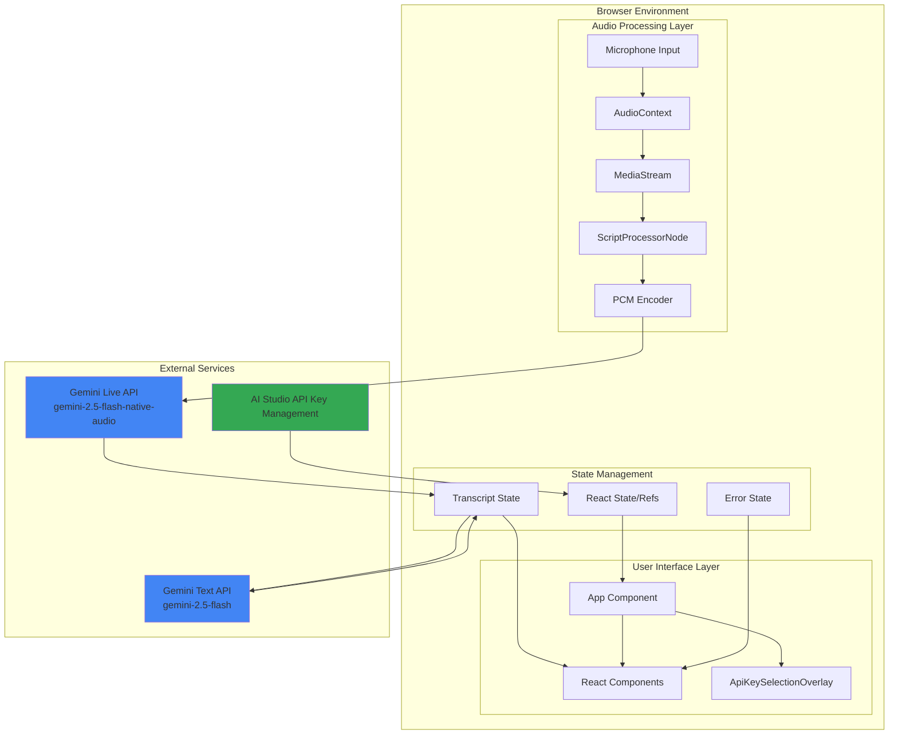

---

## クラス図

### 型定義とインターフェース

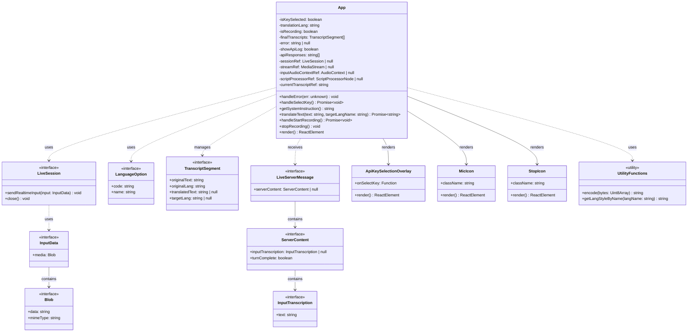

### 定数とコンフィグレーション

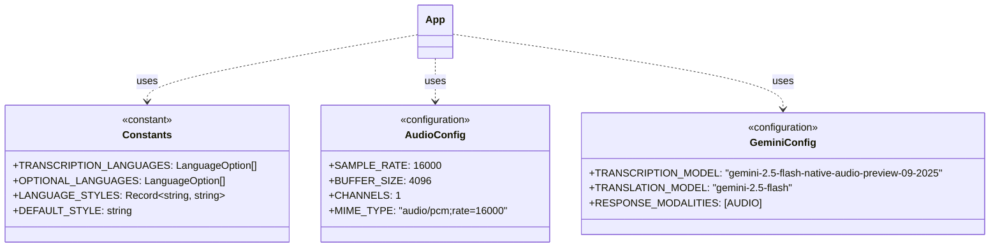

---

## コンポーネント図

### React コンポーネント階層

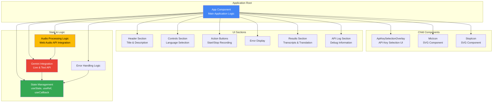

### モジュール依存関係

```mermaid
graph LR
    subgraph "External Dependencies"
        REACT[react<br/>v19.2.0]
        REACT_DOM[react-dom<br/>v19.2.0]
        GENAI[@google/genai<br/>v1.29.1]
    end

    subgraph "Application Modules"
        APP_TSX[App.tsx<br/>Main Component]
        INDEX_TSX[index.tsx<br/>Entry Point]
        GEMINI_SVC[services/geminiService.ts<br/>Placeholder]
    end

    subgraph "Build & Config"
        VITE_CONFIG[vite.config.ts<br/>Build Configuration]
        TS_CONFIG[tsconfig.json<br/>TypeScript Config]
        INDEX_HTML[index.html<br/>Template]
    end

    subgraph "Browser APIs"
        WEB_AUDIO[Web Audio API]
        MEDIA_DEVICES[MediaDevices API]
        AI_STUDIO_API[window.aistudio]
    end

    INDEX_TSX --> REACT
    INDEX_TSX --> REACT_DOM
    INDEX_TSX --> APP_TSX

    APP_TSX --> REACT
    APP_TSX --> GENAI
    APP_TSX --> WEB_AUDIO
    APP_TSX --> MEDIA_DEVICES
    APP_TSX --> AI_STUDIO_API

    VITE_CONFIG --> INDEX_HTML
    TS_CONFIG --> APP_TSX

    style GENAI fill:#4285f4,color:#fff
    style WEB_AUDIO fill:#fbbc04,color:#000
    style AI_STUDIO_API fill:#34a853,color:#fff
```

---

## シーケンス図

### 5.1 録音開始フロー

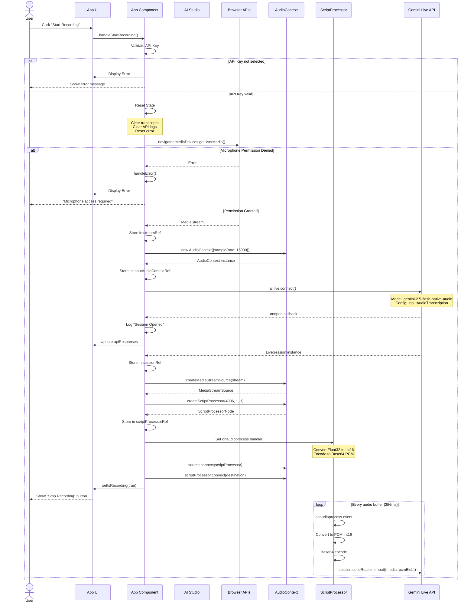

### 5.2 音声転写フロー

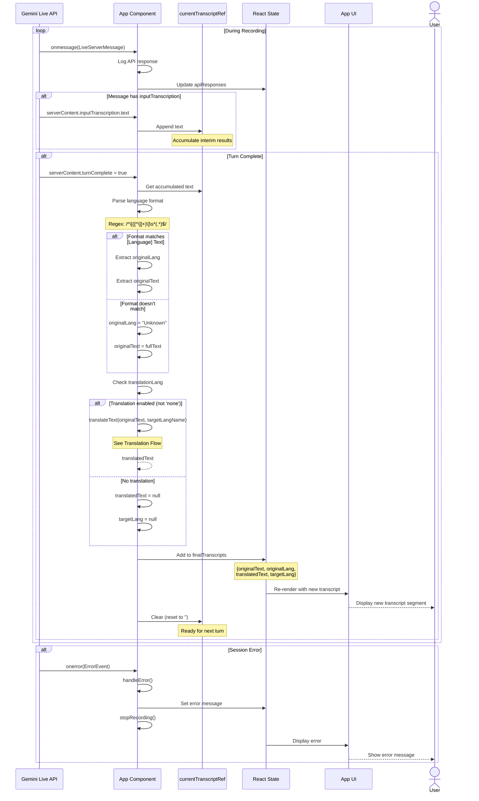

### 5.3 翻訳フロー

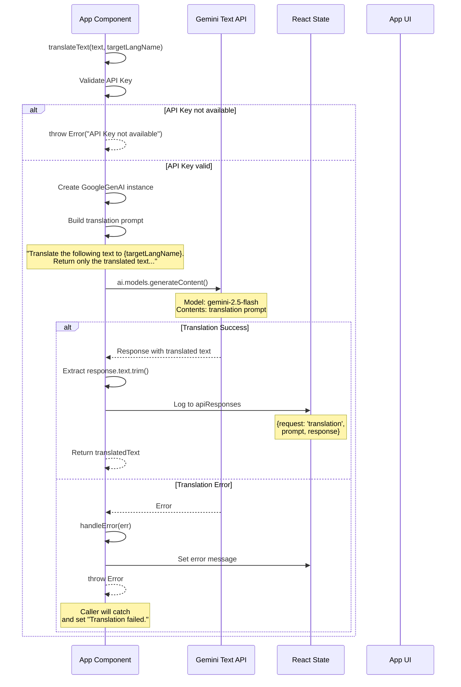

### 5.4 録音停止フロー

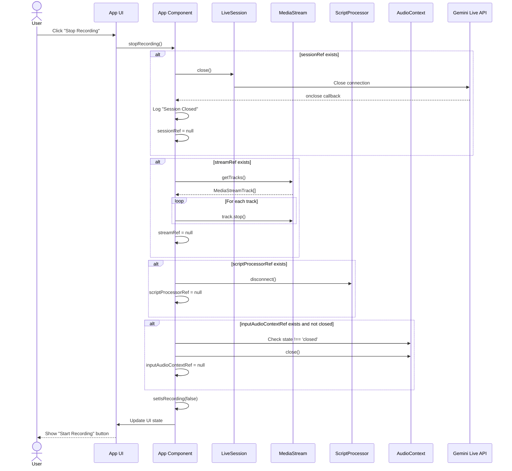

---

## 状態遷移図

### アプリケーション状態遷移

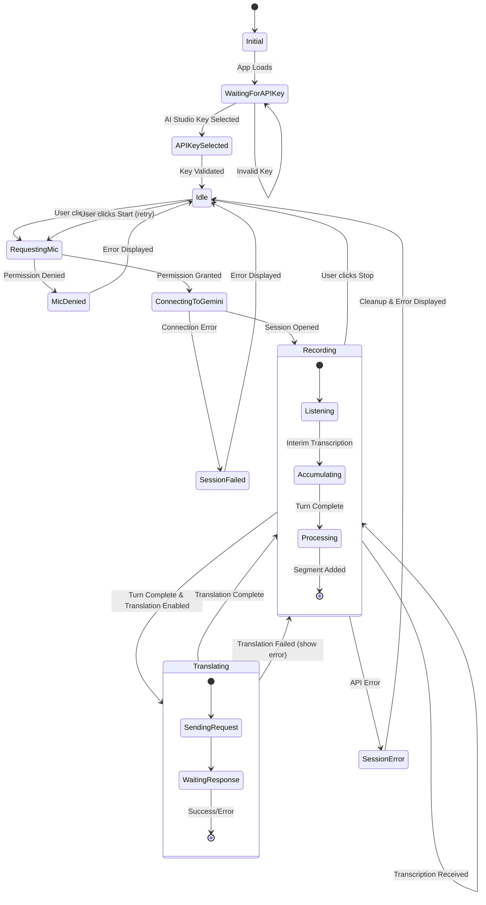

### 録音セッション状態

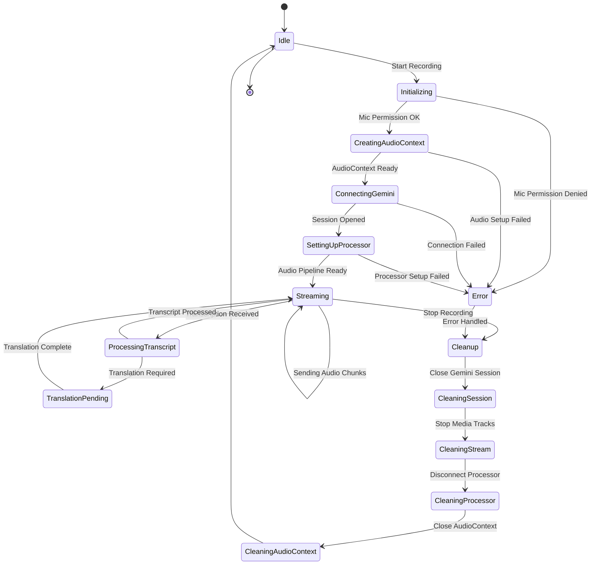

---

## データフロー図

### 音声データフロー

```mermaid
graph LR
    subgraph "Input"
        MIC[Microphone<br/>User Voice]
    end

    subgraph "Browser Audio Processing"
        MEDIA[MediaStream<br/>Raw Audio]
        AUDIO_CTX[AudioContext<br/>16kHz Sample Rate]
        SOURCE[MediaStreamSource<br/>Audio Node]
        SCRIPT[ScriptProcessor<br/>4096 Buffer]
        FLOAT32[Float32Array<br/>-1.0 to 1.0]
    end

    subgraph "Audio Encoding"
        INT16[Int16Array<br/>PCM Data]
        UINT8[Uint8Array<br/>Binary Data]
        BASE64[Base64 String<br/>Encoded]
        BLOB[PCM Blob<br/>audio/pcm;rate=16000]
    end

    subgraph "Gemini API"
        LIVE_API[Gemini Live API<br/>Streaming Endpoint]
        TRANSCRIPTION[Speech Recognition<br/>Engine]
        LANG_DETECT[Language Detection<br/>Format: [Lang] Text]
    end

    subgraph "Output Processing"
        PARSE[Text Parser<br/>Regex Matching]
        TRANSCRIPT[Transcript Segment<br/>Original Text + Lang]
    end

    MIC --> MEDIA
    MEDIA --> AUDIO_CTX
    AUDIO_CTX --> SOURCE
    SOURCE --> SCRIPT
    SCRIPT --> FLOAT32
    FLOAT32 --> INT16
    INT16 --> UINT8
    UINT8 --> BASE64
    BASE64 --> BLOB
    BLOB --> LIVE_API
    LIVE_API --> TRANSCRIPTION
    TRANSCRIPTION --> LANG_DETECT
    LANG_DETECT --> PARSE
    PARSE --> TRANSCRIPT

    style MIC fill:#fbbc04
    style LIVE_API fill:#4285f4,color:#fff
    style TRANSCRIPT fill:#34a853,color:#fff
```

### 翻訳データフロー

```mermaid
graph TD
    subgraph "Input"
        ORIGINAL[Original Text<br/>Transcribed Speech]
        TARGET_LANG[Target Language<br/>User Selection]
    end

    subgraph "Translation Logic"
        CHECK{Translation<br/>Enabled?}
        BUILD_PROMPT[Build Translation Prompt<br/>Structured Request]
    end

    subgraph "Gemini Text API"
        TEXT_API[Gemini 2.5 Flash<br/>Text Generation]
        TRANSLATE[Translation Engine<br/>Multi-language Support]
    end

    subgraph "Output"
        TRANSLATED[Translated Text<br/>Target Language]
        SEGMENT[Combined Segment<br/>Original + Translation]
    end

    subgraph "Error Handling"
        ERROR{Error?}
        FALLBACK[Set "Translation failed."]
    end

    ORIGINAL --> CHECK
    TARGET_LANG --> CHECK

    CHECK -->|Yes| BUILD_PROMPT
    CHECK -->|No| SEGMENT

    BUILD_PROMPT --> TEXT_API
    TEXT_API --> TRANSLATE
    TRANSLATE --> ERROR

    ERROR -->|No| TRANSLATED
    ERROR -->|Yes| FALLBACK

    TRANSLATED --> SEGMENT
    FALLBACK --> SEGMENT

    style TEXT_API fill:#4285f4,color:#fff
    style TRANSLATED fill:#34a853,color:#fff
    style FALLBACK fill:#ea4335,color:#fff
```

### 状態更新データフロー

```mermaid
graph TB
    subgraph "Event Sources"
        USER_INPUT[User Interactions<br/>Clicks, Selections]
        GEMINI_MSG[Gemini Messages<br/>onmessage callbacks]
        AUDIO_EVENT[Audio Events<br/>onaudioprocess]
        ERROR_EVENT[Error Events<br/>onerror callbacks]
    end

    subgraph "State Updates"
        USE_STATE[useState Hooks<br/>UI State]
        USE_REF[useRef Hooks<br/>Resource References]
        USE_CALLBACK[useCallback Hooks<br/>Memoized Functions]
    end

    subgraph "React State"
        IS_RECORDING[isRecording: boolean]
        TRANSCRIPTS[finalTranscripts: Array]
        ERROR_STATE[error: string | null]
        API_LOG[apiResponses: Array]
        TRANSLATION_LANG[translationLang: string]
        IS_KEY_SELECTED[isKeySelected: boolean]
        SHOW_LOG[showApiLog: boolean]
    end

    subgraph "React Refs"
        SESSION_REF[sessionRef: LiveSession]
        STREAM_REF[streamRef: MediaStream]
        AUDIO_REF[inputAudioContextRef: AudioContext]
        PROCESSOR_REF[scriptProcessorRef: ScriptProcessor]
        TRANSCRIPT_REF[currentTranscriptRef: string]
    end

    subgraph "UI Re-render"
        RENDER[Component Re-render<br/>Virtual DOM Update]
        DOM[Browser DOM Update]
    end

    USER_INPUT --> USE_CALLBACK
    GEMINI_MSG --> USE_CALLBACK
    AUDIO_EVENT --> USE_CALLBACK
    ERROR_EVENT --> USE_CALLBACK

    USE_CALLBACK --> USE_STATE
    USE_CALLBACK --> USE_REF

    USE_STATE --> IS_RECORDING
    USE_STATE --> TRANSCRIPTS
    USE_STATE --> ERROR_STATE
    USE_STATE --> API_LOG
    USE_STATE --> TRANSLATION_LANG
    USE_STATE --> IS_KEY_SELECTED
    USE_STATE --> SHOW_LOG

    USE_REF --> SESSION_REF
    USE_REF --> STREAM_REF
    USE_REF --> AUDIO_REF
    USE_REF --> PROCESSOR_REF
    USE_REF --> TRANSCRIPT_REF

    IS_RECORDING --> RENDER
    TRANSCRIPTS --> RENDER
    ERROR_STATE --> RENDER
    API_LOG --> RENDER
    TRANSLATION_LANG --> RENDER
    IS_KEY_SELECTED --> RENDER
    SHOW_LOG --> RENDER

    RENDER --> DOM

    style USE_STATE fill:#61dafb,color:#000
    style USE_REF fill:#61dafb,color:#000
    style RENDER fill:#34a853,color:#fff
```

---

## データモデル

### エンティティ関係図

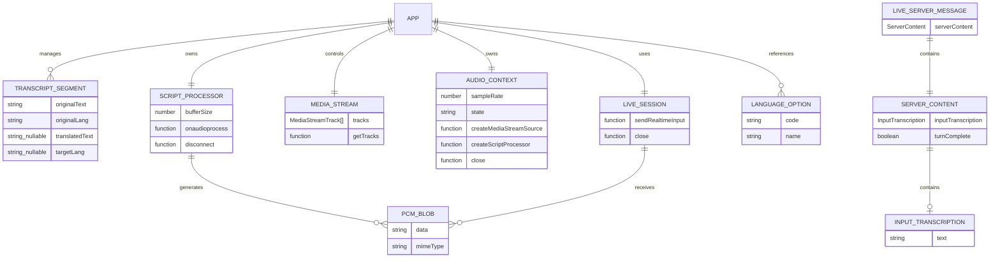

### 型定義詳細

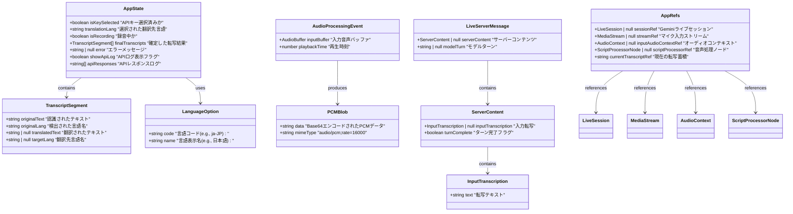

---

## 補足情報

### Web Audio API フロー詳細

**ScriptProcessorNode (非推奨だが使用中)**

```
getUserMedia()
  → MediaStream
  → AudioContext (16kHz)
  → MediaStreamSource
  → ScriptProcessorNode (4096 buffer)
  → onaudioprocess event (毎 256ms)
  → Float32Array → Int16Array → Base64 → PCM Blob
  → Gemini Live API
```

**将来の移行パス**: AudioWorklet への移行推奨

### Gemini API 統合詳細

**転写用モデル**
- モデル名: `gemini-2.5-flash-native-audio-preview-09-2025`
- 入力: PCM音声 (16kHz, Int16)
- 出力形式: `[言語名] 転写テキスト`
- コールバック: `onopen`, `onmessage`, `onerror`, `onclose`

**翻訳用モデル**
- モデル名: `gemini-2.5-flash`
- 入力: テキストプロンプト
- 出力: 翻訳テキスト
- 呼び出し: `ai.models.generateContent()`

### エラーハンドリングパターン

```typescript
handleError(err: unknown) {
  // 1. エラーメッセージ抽出
  const errorMessage = err instanceof Error ? err.message : 'Unknown error'

  // 2. エラー種別判定
  if (errorMessage.includes('Requested entity was not found.')) {
    // APIキー無効
    setError('API Key is invalid')
    setIsKeySelected(false)
  } else {
    // その他のエラー
    setError(errorMessage)
  }

  // 3. コンソールログ
  console.error(err)
}
```

### クリーンアップパターン

```typescript
stopRecording() {
  // 1. Geminiセッションクローズ
  if (sessionRef.current) {
    sessionRef.current.close()
    sessionRef.current = null
  }

  // 2. メディアストリーム停止
  if (streamRef.current) {
    streamRef.current.getTracks().forEach(track => track.stop())
    streamRef.current = null
  }

  // 3. 音声処理ノード切断
  if (scriptProcessorRef.current) {
    scriptProcessorRef.current.disconnect()
    scriptProcessorRef.current = null
  }

  // 4. AudioContextクローズ
  if (inputAudioContextRef.current && inputAudioContextRef.current.state !== 'closed') {
    inputAudioContextRef.current.close()
  }

  // 5. 状態リセット
  setIsRecording(false)
}
```

---

## 改善提案

### 1. AudioWorklet への移行

ScriptProcessorNode は非推奨のため、AudioWorklet への移行を推奨。

```javascript
// 現在 (非推奨)
const scriptProcessor = context.createScriptProcessor(4096, 1, 1)

// 推奨される方法
await context.audioWorklet.addModule('audio-processor.js')
const workletNode = new AudioWorkletNode(context, 'audio-processor')
```

### 2. コンポーネント分割

App.tsx (435行) を複数ファイルに分割:
- `components/AudioRecorder.tsx`
- `components/TranscriptDisplay.tsx`
- `components/ApiKeyManager.tsx`
- `hooks/useGeminiLive.ts`
- `hooks/useAudioProcessing.ts`

### 3. テストの追加

- ユニットテスト: Jest + React Testing Library
- E2Eテスト: Playwright
- 音声処理テスト: Web Audio API モック

### 4. 状態管理の改善

- React Context API または Redux の導入
- グローバル状態の一元管理
- 状態更新ロジックの分離

### 5. パフォーマンス最適化

- `React.memo()` でコンポーネントのメモ化
- `useMemo()` で重い計算結果のキャッシュ
- 仮想スクロール (長時間の転写結果表示時)
- デバウンス処理 (転写結果の頻繁な更新)

---

## まとめ

本UML仕様書は、Gemini-STT-v2アプリケーションの包括的な設計ドキュメントです。

**カバー範囲**:
- ✅ システムアーキテクチャ
- ✅ クラス図・型定義
- ✅ コンポーネント構成
- ✅ シーケンス図 (4種類の主要フロー)
- ✅ 状態遷移図
- ✅ データフロー図
- ✅ データモデル・ER図

**活用方法**:
- 新機能追加時の設計参考
- バグ修正時のフロー理解
- チームメンバーへのオンボーディング
- リファクタリング計画の策定
- テストケース設計の基礎資料

**更新推奨**: 重要な機能追加や構造変更時に本ドキュメントを更新してください。

---

**Document Version:** 1.0
**Last Updated:** 2025-11-15
**Author:** AI Assistant (Claude)
**Project Repository:** Gemini-STT-v2
